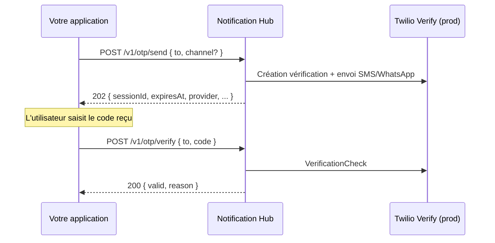

# Intégration OTP — guide client

Ce document s’adresse aux équipes qui consomment **Notification Hub** depuis leurs applications
(CleanTrack, BCMS, Elykia, …) pour envoyer et vérifier des codes OTP (SMS ou WhatsApp).

> **Configuration côté hub** (Twilio Verify, secrets prod, providers) : voir [OTP.md](OTP.md).  
> **Authentification Keycloak** (service account, `tenant_id`) : voir [SERVICE_ACCOUNTS.md](../../deploy/keycloak/SERVICE_ACCOUNTS.md).

---

## Vue d’ensemble

Le hub expose un flux OTP en **deux appels HTTP** :



**Responsabilités :**

| Composant | Rôle |
|-----------|------|
| **Votre app** | Collecte le numéro, appelle send/verify, gère l’UX (écran saisie, messages d’erreur) |
| **Notification Hub** | Authentification, multi-tenant, routage vers le provider OTP configuré |
| **Twilio Verify** (prod) | Génération du code, envoi, expiration, compteur de tentatives |

Vous **ne générez pas** le code OTP côté client. Vous **ne stockez pas** le code en clair.

---

## Endpoints

| Méthode | Chemin | Description |
|---------|--------|-------------|
| `POST` | `/v1/otp/send` | Demande l’envoi d’un OTP |
| `POST` | `/v1/otp/verify` | Vérifie le code saisi par l’utilisateur |

**Base URL prod :** `https://notification-api.optimizesolux.com`  
**Base URL local :** `http://localhost:8088` (profil `local`)

---

## Authentification

### Production (JWT obligatoire)

1. Obtenir un token OAuth2 **Client Credentials** auprès de Keycloak.
2. Appeler le hub avec `Authorization: Bearer <access_token>`.
3. Le claim **`tenant_id`** du JWT identifie le tenant — **ne pas** compter sur `X-Tenant-Id` en prod.

```bash
TOKEN=$(curl -s -X POST \
  "https://notification-auth.optimizesolux.com/realms/notification-hub/protocol/openid-connect/token" \
  -H "Content-Type: application/x-www-form-urlencoded" \
  -d "grant_type=client_credentials" \
  -d "client_id=VOTRE_CLIENT_ID" \
  -d "client_secret=$CLIENT_SECRET" | jq -r .access_token)
```

Prérequis détaillés : [SERVICE_ACCOUNTS.md](../../deploy/keycloak/SERVICE_ACCOUNTS.md).

### Développement local (JWT optionnel)

Avec le profil Spring `local`, le header suffit :

```http
X-Tenant-Id: demo-tenant
```

---

## Headers communs

| Header | Obligatoire | Description |
|--------|-------------|-------------|
| `Authorization` | Oui (prod) | `Bearer <JWT>` |
| `Content-Type` | Oui | `application/json` |
| `Idempotency-Key` | Recommandé sur **send** | UUID unique — évite les doubles envois en cas de retry réseau |
| `X-App-Id` | Optionnel | Identifiant applicatif pour l’audit / traçabilité |
| `X-Tenant-Id` | Local uniquement | Ignoré en prod si JWT présent |

---

## POST /v1/otp/send

Demande l’envoi d’un code OTP au numéro indiqué.

### Corps de requête

```json
{
  "to": "+22890909090",
  "channel": "SMS",
  "environment": "test",
  "metadata": {}
}
```

| Champ | Type | Obligatoire | Description |
|-------|------|-------------|-------------|
| `to` | string | **Oui** | Numéro au format **E.164** (`+228…`, `+33…`) |
| `channel` | string | Non | `SMS` ou `WHATSAPP`. Si omis : canal par défaut du hub (`OTP_DEFAULT_CHANNEL`, souvent `SMS` en prod) |
| `environment` | string | Non | `test` (défaut) ou `prod`. **SMS uniquement** : si ≠ `prod`, aucun SMS réel — copie email à **sms@optimizesolux.com**. WhatsApp ignore ce champ. |
| `metadata` | object | Non | Métadonnées libres (réservé usage futur / audit) |

### Réponse — `202 Accepted`

```json
{
  "sessionId": "a1b2c3d4-e5f6-7890-abcd-ef1234567890",
  "expiresAt": "2026-08-31T20:26:00Z",
  "notificationId": null,
  "channel": "SMS",
  "provider": "internal",
  "providerReference": "a1b2c3d4-e5f6-7890-abcd-ef1234567890",
  "reference": "Y4GP"
}
```

| Champ | Description |
|-------|-------------|
| `sessionId` | Identifiant de session côté hub (utile avec le provider `internal`) |
| `expiresAt` | Expiration indicative (~5 min avec provider `internal`, ~10 min avec Twilio Verify) |
| `notificationId` | ID notification hub si provider `internal` ; `null` avec Twilio Verify |
| `channel` | Canal effectivement utilisé |
| `provider` | `twilio-verify` ou `internal` |
| `providerReference` | Référence Twilio (`VE…`) ou session interne — pour le support / logs, pas pour la vérif côté client |
| `reference` | Référence courte alphanumérique (ex. `Y4GP`) générée par le hub (provider `internal`) pour distinguer les SMS en cas de renvois. **Affichez-la** : « Saisissez le code à 6 chiffres associé à la référence Y4GP ». `null` avec Twilio Verify (le SMS est rédigé par Twilio). WhatsApp : renvoyée mais absente du template message. |

Le SMS (provider `internal`) contient aussi cette référence via le placeholder `{{reference}}` du template (`OTP_SMS_BODY_TEMPLATE`). Exemple par défaut :

`Votre code de verification est 131584 (ref. Y4GP). Valide 5 minutes.`

En environnement `test`, la copie email vers `sms@optimizesolux.com` reprend ce corps (référence incluse).

### Exemple curl (prod)

```bash
curl -s -X POST "https://notification-api.optimizesolux.com/v1/otp/send" \
  -H "Authorization: Bearer $TOKEN" \
  -H "Content-Type: application/json" \
  -H "Idempotency-Key: $(uuidgen)" \
  -d '{"to": "+22890909090", "channel": "SMS", "environment": "test"}'
```

### Exemple curl (local)

```bash
curl -s -X POST "http://localhost:8088/v1/otp/send" \
  -H "Content-Type: application/json" \
  -H "X-Tenant-Id: demo-tenant" \
  -H "Idempotency-Key: demo-otp-1" \
  -d '{"to": "+22890909090", "environment": "test"}'
```

---

## POST /v1/otp/verify

Vérifie le code saisi par l’utilisateur.

### Corps de requête

```json
{
  "to": "+22890909090",
  "code": "123456",
  "channel": null,
  "sessionId": null
}
```

| Champ | Type | Obligatoire | Description |
|-------|------|-------------|-------------|
| `to` | string | **Oui** | Même numéro E.164 que pour `send` |
| `code` | string | **Oui** | Code saisi par l’utilisateur (espaces en début/fin ignorés) |
| `channel` | string | Non | Réservé provider `internal` |
| `sessionId` | UUID | Non | Réservé provider `internal` — avec Twilio Verify, seuls `to` + `code` suffisent |

### Réponse — `200 OK`

```json
{
  "valid": true,
  "reason": "VALID"
}
```

| `valid` | `reason` | Signification côté app |
|---------|----------|------------------------|
| `true` | `VALID` | Code correct — poursuivre le flux (connexion, validation transaction, …) |
| `false` | `INVALID` | Code incorrect — inviter à réessayer |
| `false` | `EXPIRED` | Session expirée ou inexistante — proposer **Renvoyer le code** (`/send`) |
| `false` | `MAX_ATTEMPTS` | Trop de tentatives — bloquer temporairement ou renvoyer un nouveau code |

> La réponse HTTP reste **200** même si le code est invalide. Utilisez le champ **`valid`**, pas le status HTTP.

### Exemple curl

```bash
curl -s -X POST "https://notification-api.optimizesolux.com/v1/otp/verify" \
  -H "Authorization: Bearer $TOKEN" \
  -H "Content-Type: application/json" \
  -d '{"to": "+22890909090", "code": "123456"}'
```

---

## Erreurs HTTP (hors verify)

| HTTP | Code (`problem.code`) | Cause | Action client |
|------|----------------------|-------|---------------|
| `401` | — | JWT absent / expiré / invalide | Renouveler le token Client Credentials |
| `403` | — | Rôle `notification-sender` manquant | Contacter l’équipe plateforme |
| `422` | `OTP_NOT_CONFIGURED` | Hub mal configuré (ex. Verify SID manquant) | Contacter l’équipe plateforme |
| `429` | `OTP_RESEND_COOLDOWN` | Renvoi trop rapide (provider `internal` uniquement) | Attendre avant un nouvel envoi |
| `503` | — | OTP désactivé (`OTP_ENABLED=false`) | Contacter l’équipe plateforme |

Format d’erreur : RFC 7807 Problem Details (`application/problem+json`).

---

## Intégration Spring Boot (recommandée)

### Dépendance

```xml
<dependency>
  <groupId>com.optimize.notification</groupId>
  <artifactId>sb-notification-hub-starter</artifactId>
  <version>0.1.0-SNAPSHOT</version>
</dependency>
```

Voir [mvn/README.md](../../mvn/README.md) pour GitHub Packages et la configuration OAuth2.

### Configuration

```yaml
optimize:
  notification:
    hub:
      base-url: https://notification-api.optimizesolux.com
      oauth2:
        token-uri: https://notification-auth.optimizesolux.com/realms/notification-hub/protocol/openid-connect/token
        client-id: clean-track-pro
        client-secret: ${NOTIFICATION_HUB_CLIENT_SECRET}
      # environment: omis → dérivé du profil Spring (prod/production → prod, sinon test)
```

Le starter injecte `environment` sur `send` / `sendOtp` (SMS). Profil `local`/`dev`/`test` → email de recette (`sms@optimizesolux.com`), pas de crédit SMS. Profil `prod` → SMS réel.

### Exemple de service métier

```java
@Service
public class PhoneVerificationService {

    private final NotificationHubClient hub;

    public PhoneVerificationService(NotificationHubClient hub) {
        this.hub = hub;
    }

    /** Étape 1 — après saisie du numéro par l'utilisateur. */
    public OtpSendResponse requestCode(String e164Phone) {
        return hub.sendOtp(
                OtpSendRequest.sms(e164Phone),
                UUID.randomUUID().toString()); // Idempotency-Key
    }

    /** Étape 2 — après saisie du code par l'utilisateur. */
    public boolean confirmCode(String e164Phone, String userCode) {
        OtpVerifyResponse result = hub.verifyOtp(OtpVerifyRequest.of(e164Phone, userCode));
        return result.valid();
    }
}
```

Canal WhatsApp explicite :

```java
hub.sendOtp(OtpSendRequest.whatsApp("+22890909090"), idempotencyKey);
```

Gestion UX des raisons d’échec :

```java
OtpVerifyResponse r = hub.verifyOtp(OtpVerifyRequest.of(phone, code));
if (r.valid()) {
    // succès
} else {
    switch (r.reason()) {
        case INVALID -> showError("Code incorrect");
        case EXPIRED -> showError("Code expiré — demandez un nouveau code");
        case MAX_ATTEMPTS -> showError("Trop de tentatives — réessayez plus tard");
        default -> showError("Vérification impossible");
    }
}
```

---

## Intégration HTTP (autres langages)

Même contrat REST pour Node, Python, PHP, mobile, etc.

1. **Token** : `POST` sur l’endpoint token Keycloak (`grant_type=client_credentials`).
2. **Send** : `POST {baseUrl}/v1/otp/send` avec Bearer + JSON `{ "to": "+…" }`.
3. **Verify** : `POST {baseUrl}/v1/otp/verify` avec Bearer + JSON `{ "to": "+…", "code": "…" }`.

Renouvelez le JWT avant expiration (typiquement 5–15 min selon la config realm).

---

## Bonnes pratiques côté application

1. **Format E.164** — normaliser le numéro côté app (`+228…`) avant l’appel.
2. **Idempotency-Key** — un UUID par clic « Envoyer le code » ; réutiliser la même clé seulement en cas de retry réseau identique.
3. **Ne jamais logger le code OTP** ni le renvoyer au frontend depuis votre backend.
4. **UX verify** — distinguer `INVALID` (réessayer) et `EXPIRED` (renvoyer). Afficher la `reference` renvoyée par `/send` pour guider l'utilisateur vers le bon SMS.
5. **Rate limiting UX** — limiter les clics « Renvoyer » côté UI (ex. 60 s) même si le hub autorise plus.
6. **Tenant** — une app = un client Keycloak = un `tenant_id` ; ne pas mélanger les tenants.
7. **Canal** — en prod actuelle le défaut est **SMS** ; passer `"channel": "WHATSAPP"` uniquement quand le sender WhatsApp prod est validé par la plateforme.
8. **Environnement SMS** — omettre `environment` (défaut `test`) tant que vous n’êtes pas prêts à consommer des crédits. Le starter Spring le dérive du profil actif. Pour un vrai SMS : `"environment": "prod"` (ou profil `prod`). Les envois test arrivent sur **sms@optimizesolux.com** (Mailpit http://localhost:8025 en local, Resend en prod).

---

## Compte Twilio Trial (dev)

Si le hub pointe vers un compte Twilio **Trial**, seuls les numéros **vérifiés** dans la console Twilio recevront l’OTP. Ce n’est pas une limitation de l’API client — contacter l’équipe infra pour les tests prod.

---

## Checklist intégration OTP

- [ ] Service account Keycloak créé avec rôle `notification-sender`
- [ ] Claim `tenant_id` présent dans le JWT
- [ ] Secret client stocké hors git (variable d’env / vault)
- [ ] `optimize.notification.hub.base-url` pointant vers la bonne URL
- [ ] Profil Spring / `environment` : `test` (email `sms@optimizesolux.com`) en recette, `prod` seulement pour les vrais SMS
- [ ] Flux UI : saisie numéro → `send` → saisie code → `verify`
- [ ] Gestion des `reason` : `INVALID`, `EXPIRED`, `MAX_ATTEMPTS`
- [ ] `Idempotency-Key` sur chaque `send`
- [ ] Tests bout-en-bout sur l’environnement cible (local puis prod)

---

## Voir aussi

| Document | Contenu |
|----------|---------|
| [OTP.md](OTP.md) | Configuration hub, Twilio Verify, provider `internal` |
| [SERVICE_ACCOUNTS.md](../../deploy/keycloak/SERVICE_ACCOUNTS.md) | Création client Keycloak |
| [mvn/README.md](../../mvn/README.md) | Starter Spring Boot, build, déploiement artifact |
| [WHATSAPP_TWILIO.md](WHATSAPP_TWILIO.md) | WhatsApp manuel (sans module OTP) |
